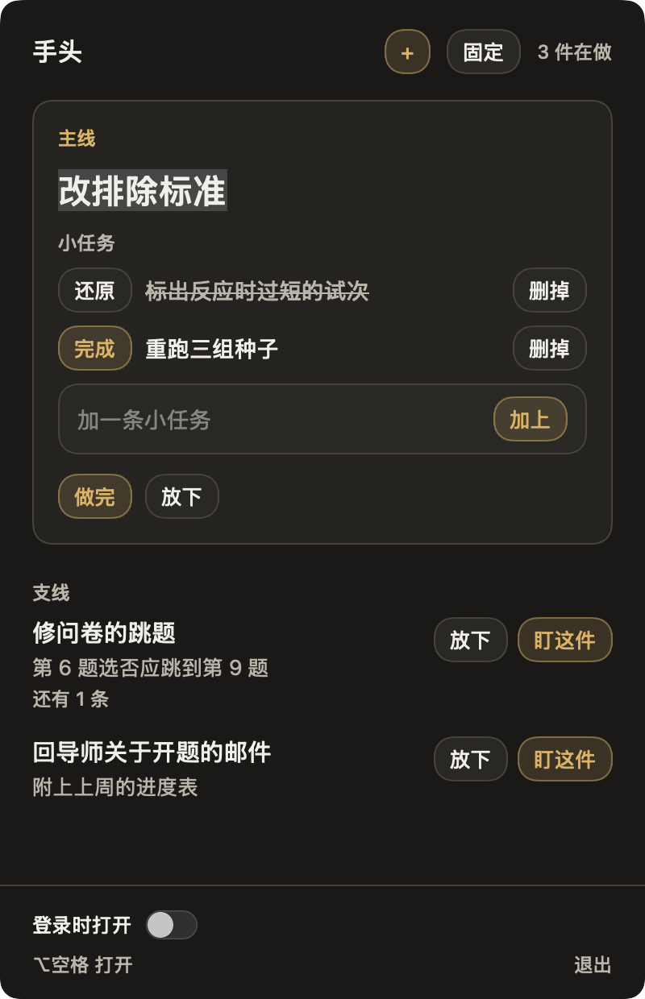
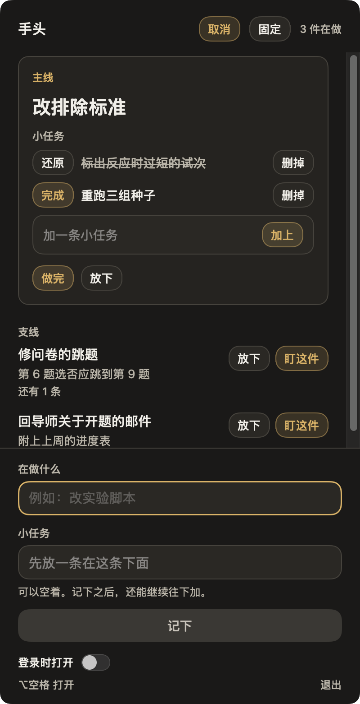

# 手头

同时做几件事时，菜单栏一直留着你现在盯着的那一件。

主线是当前这件事，下面可以挂几条小任务。支线是另外还开着的事。

## 安装

从 [最新 Release](https://github.com/Aux-724/shoutou/releases/latest) 下载磁盘镜像。需要 macOS 14 或更新的系统，Apple 芯片和 Intel 都可以。

1. 打开镜像，把「手头」拖到「应用程序」。
2. 打开它。程序坞里不会出现图标，菜单栏右侧会有一面旗子。
3. 如果系统提示无法打开，到「系统设置」，进入「隐私与安全性」，点「仍要打开」。

## 使用

点右上角的 **+** 记下一条新任务。小任务可以先写一条，也可以空着，之后再往主线下面加。

- **盯这件** 把一条支线换成主线。菜单栏上的字会跟着换。
- **放下** 是先搁着，**做完** 是收起来。放下的可以捡回来。
- 小任务点 **完成** 会划掉。菜单栏的提示改成下一条还没做的。
- **固定** 之后，面板留在最前面，点别的窗口也不会关。拖标题栏的空白处可以挪开。
- 拖面板边缘可以拉大或缩小，这个尺寸会记住。
- 按住 Option 再按空格，打开或收起面板。

记录保存在本机的 `~/Library/Application Support/Shoutou/quests.json`。
